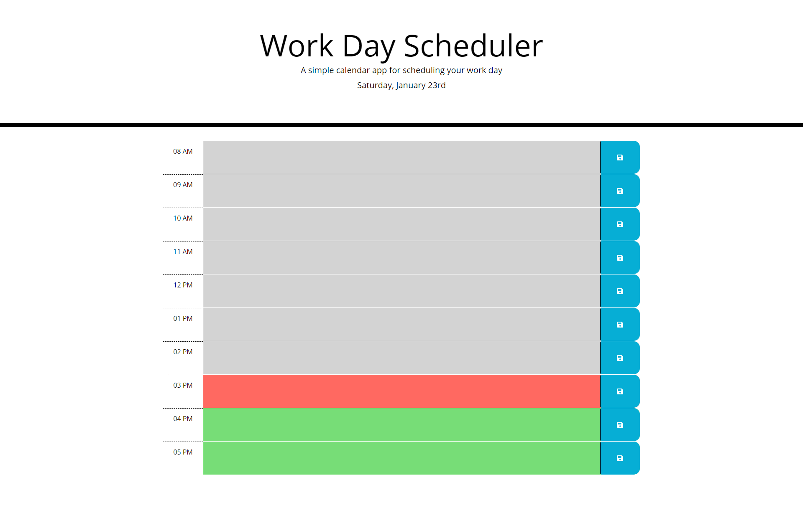
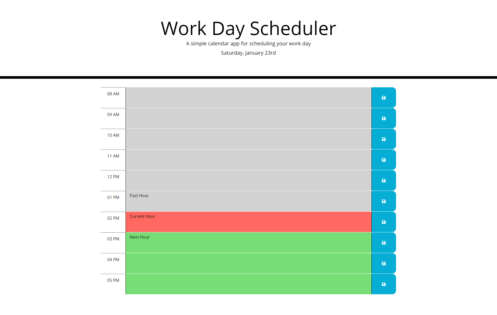

# 05-Work-Day-Scheduler

## Purpose
A website created to Schedule a typical work day hours(8am-5pm). 

## Built With
* HTML
* CSS
* JavaScript
* Bootstrap
* Jquery
* moment.js

## Screenshot
- When the hour has passed it will appear grey.
- When it is the current hour it will appear red.
- And for the later hours will appear green.

## Link to Website
https://jcc83267.github.io/05-Work-Day-Scheduler/
